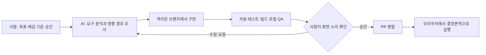

# AI 활용 기술 설명 초안

이 문서는 NHN2026 제출용 「AI 활용 기술 문서」의 구조 설명 부분에 재사용할 수 있도록, `desk64` 세션 요약과 저장소 구현을 교차 확인한 기술 메모다. 대화 근거의 컷오프는 2026-08-10 19:38:37 KST이며, 코드 근거는 2026-08-10에 확인한 `origin/main` 커밋 `af652c3`을 기준으로 한다.

## 1. AI가 사용된 위치

Clicker Guild에서 AI는 게임 실행 중 판단을 내리는 런타임 기능이 아니라 **개발 단계의 분석·구현·검증·협업 보조 도구**로 사용됐다. 현재 의존성에는 AI 모델 SDK가 없고, 게임 코드도 플레이 중 외부 모델을 호출하지 않는다. AI가 만든 코드·음악·시각 시안은 검토와 테스트를 거쳐 TypeScript/React 구현 또는 정적 자산으로 확정된 뒤 일반 웹게임처럼 브라우저에서 실행된다.

사람은 세계관, 용어, 난이도, 조작감, 음악의 반복감처럼 주관적 판단이 필요한 기준과 최종 병합 여부를 결정했다. AI는 기존 코드 조사, 작업 분해, 구현, 회귀 검증, 미리보기 제공, Issue·PR 기록을 담당했다.

## 2. 애플리케이션 구조

게임은 Next.js 16, React 19, TypeScript 기반이며 Vinext/Vite로 빌드한다.

- `app/page.tsx`: `OpeningGate`, `BgmController`, `Game`을 조합한다.
- `app/layout.tsx`: 전역 무기 공격 오디오 컴포넌트를 한 번 마운트한다.
- `app/Game.tsx`: 길드·전투·저장 상태를 React 상태와 브라우저 `localStorage`로 관리하고, 길드 시설·스테이지·오디오·특수공격·피날레 모듈을 연결한다.
- `app/bullet-hell/BulletHellFinale.tsx`: 마지막 스테이지 뒤 기존 전장 안에서 2페이즈 최종전을 표시한다.
- `app/bullet-hell/engine.ts`: 화면 표현과 분리된 최종전 상태·물리 규칙을 계산한다.
- `app/bullet-hell/assets.ts`, `boss-silhouette.ts`: 자산 명세와 코드 기반 보스 형태를 정의한다.
- `app/bullet-hell/fracture-geometry.ts`, `page-fracture.ts`: 1페이즈에서 2페이즈로 넘어가는 화면 파쇄를 계산·구성한다.
- `app/bullet-hell/FinaleDevHarness.tsx`, `app/bullet-hell/preview/page.tsx`: 저장 진행도와 분리해 최종전을 빠르게 시험한다.

이 분리는 AI가 엔진, 렌더링, 자산, 화면 전환, 테스트를 서로 다른 작업으로 나누어 탐색한 방식과 맞는다. `Game.tsx`나 공용 오디오처럼 통합 위험이 큰 파일은 한 작업 흐름에서 합쳤다.

## 3. AI 보조 개발 절차

실제 세션에서 반복된 절차는 다음과 같다.

1. 사용자가 기능 목표와 체감 기준을 제시한다.
2. AI가 기존 코드, 저장 호환, 테스트, 다른 진행 작업과 겹치는 수정 경로를 조사한다.
3. GitHub Issue에 담당·범위·기준 커밋을 남기고 독립 worktree와 `codex/*` 브랜치를 만든다.
4. 경로가 겹치지 않는 큰 작업은 엔진·연출·테스트·브라우저 QA로 분리한다.
5. 구현 뒤 단위·렌더링·회귀 테스트와 lint·production build를 실행한다.
6. 전용 로컬 서버에서 데스크톱·모바일 화면 또는 오디오를 사람이 확인한다.
7. 피드백을 구현과 회귀 조건에 반영하고, 사용자가 승인한 PR만 병합한다.
8. 병합 뒤 확인 서버와 임시 작업을 정리하고 Issue·PR에 결과를 남긴다.

저장소의 `AGENTS.md`, `docs/coordination/README.md`, `docs/coordination/ONBOARDING.md`가 이 절차를 공용 규칙으로 보존한다. 즉 세션의 대화 기억에만 의존하지 않고 Issue는 작업 상태와 소유권, PR은 코드와 검증, Discussion은 여러 작업에 걸친 결정을 기록하는 공용 기억으로 사용했다.

## 4. 대표 기술 사례

### 4.1 효과음 설정과 믹싱 경로 통합

사용자는 보상음과 종료 팡파레가 묻히지만 전체 효과음을 높이면 타격음이 과도해지는 문제를 제시했다. AI는 단순히 파일 음량만 키우지 않고 여러 오디오 출력 경로를 추적했다.

- `app/audio-settings.ts`는 BGM/SFX 음소거와 볼륨을 정규화·저장하고, 구형 설정을 새 형식으로 이관한다.
- `app/bgm/BgmController.tsx`는 두 `HTMLAudioElement`와 유효 BGM 볼륨을 사용한다.
- `app/battle-audio.ts`는 개별 음원·합성음에서 믹스 버스와 SFX master gain을 거쳐 출력한다.
- `app/weapon-audio.ts`는 dry/reverb send, master, compressor를 사용하며 전역 설정 변경을 구독한다.
- `app/special-attack-audio.ts`도 별도 master gain에서 같은 SFX 설정을 따른다.

사용자가 일부 무기 타격음이 설정을 우회한다고 추정한 뒤 AI가 누락 경로를 찾아 15종 무기 음원을 공통 설정에 연결했다. 0%에서 완전히 음소거되고 단계별 볼륨이 일관되는지 `tests/audio-mix-balance.test.mjs`, `weapon-audio.test.mjs`, `event-sfx.test.mjs`, `progression-proc-reward-sfx.test.mjs`, `battle-audio-assets.test.mjs`로 회귀 검증했다.

### 4.2 생성형 BGM의 장면별 순환

사용자는 AI 음악 서비스에서 만든 일반전 두 곡과 보스전 두 곡을 모두 쓰기로 결정했다. `app/bgm/tracks.ts`가 장면별 곡 풀을 정의하고, `app/bgm/BgmController.tsx`가 장면 ID가 실제로 바뀔 때만 해당 풀의 커서를 진행한다. 관련 없는 DOM 변화로 곡이 다시 뽑히는 문제를 피하고, 두 플레이어를 번갈아 사용해 약 1.15초 크로스페이드를 만든다. 자동재생 제한 때문에 첫 사용자 입력 뒤 재생을 시작한다.

피날레의 여러 내부 단계는 하나의 보스 조우로 취급해 중간에 곡을 교체하지 않고, 파괴·백색 전환에서는 별도 감쇠를 적용한다. `tests/bgm-track-rotation.test.mjs`와 `tests/bgm-finale.test.mjs`가 순환과 피날레 연속성을 확인한다. 음악은 AI가 프롬프트와 편집 옵션을 제안하고 사람이 듣고 선택했으며, 게임 안에서는 생성 모델이 아니라 내려받은 정적 오디오 파일이 재생된다.

### 4.3 글리치 보스 2페이즈와 탄막 엔진

`app/bullet-hell/engine.ts`는 960×600 논리 좌표, 16ms 고정 스텝, 시드 기반 난수와 입력·상태를 받아 새 월드를 반환하는 방식으로 구현됐다. 긴 프레임은 최대 512ms로 제한해 일시적인 멈춤 뒤 물리 계산이 폭주하는 것을 막는다.

최종전은 기존 전장에서 보스를 클릭하는 1페이즈, 약 1.8초의 `collapse`, 길드 건물을 움직여 탄막을 피하는 2페이즈, `destruction`, `whiteout` 순서로 진행된다. 2페이즈는 6초 회피와 2.5초 코어 노출을 반복하고 직접 클릭은 125ms 간격으로 제한한다. 기존 성장 수치를 모두 반입하지 않고 길드 본관 레벨만 제한적으로 반영해 이벤트전 규칙을 독립시켰다. 패배 뒤에는 1페이즈 전체를 되풀이하지 않고 2페이즈를 다시 시험할 수 있다.

`app/bullet-hell/boss-silhouette.ts`는 여러 문자 체계의 글리프 36개를 원형 몸체 안에 배치한다. 글자, 크기, RGB 분리와 깜빡임은 경과 시간과 인덱스로부터 계산해 독립 타이머나 무작위 호출 없이 재현 가능하다. 캔버스 렌더러는 키보드·터치 입력, 일시정지, 반응형 픽셀 비율, 동작 줄이기 설정을 담당한다. 관련 검증은 `tests/bullet-hell-engine.test.mjs`, `bullet-hell-integration.test.mjs`, `bullet-hell-boss-visual.test.mjs`, `bullet-hell-preview.test.mjs`, `bullet-hell-assets.test.mjs`에 있다.

### 4.4 화면 파쇄 PoC의 제품화

AI와 사용자는 CSS·JavaScript 개념증명을 먼저 조작해 본 뒤 실제 피날레에 필요한 부분을 제품 코드로 옮겼다. `fracture-geometry.ts`는 화면을 3×2 셀로 나누고 각 셀을 삼각형 둘로 쪼개 겹치지 않는 12개 조각을 시드 기반으로 만든다. `page-fracture.ts`는 현재 페이지의 시각 전용 복제본에서 ID·ARIA 참조·포커스·포인터 동작을 제거해 비활성 상태로 만든다. 보스는 파쇄 조각에서 제외해 별도 레이어에 두므로 전환 전후 위치가 흔들리지 않는다.

애니메이션은 독립 타이머가 아니라 엔진의 `collapse` 경과 시간을 사용해 일시정지·강제 시험 모드와 동기화된다. 동작 줄이기 설정에서는 조각 이동 대신 정적 균열의 짧은 전환을 사용한다. 관련 검증은 `tests/bullet-hell-fracture.test.mjs`와 `bullet-hell-integration.test.mjs`에 있다.

## 5. 다중 에이전트 분업

큰 피날레 작업에서 총괄 AI는 공통 계약과 통합 경로를 잡고, 하위 작업을 엔진, 시각·입력, 자산·보스, 화면 전환, 테스트·QA로 나눴다. 수정 경로가 겹치지 않을 때만 병렬 실행하고, 통합 파일과 공용 상태는 한 흐름에서 병합했다. 각 하위 작업의 원문 로그와 개인 식별 정보는 이 취합본에서 제외했으므로 최종 PDF에는 특정 에이전트나 사람별 기여를 단정하지 않고 역할 범주만 기술해야 한다.

## 6. 확정 구현과 검토 중 개선의 구분

`origin/main`에 병합된 기본 피날레와 화면 파쇄는 확정 구현으로 설명할 수 있다. 반면 다음 내용은 대화 컷오프 시점에는 요구 재정의 또는 검토 중이었고, 이후에도 draft PR #138의 후속 개선으로 관리되므로 최종 PDF에서 완료 기능과 분리해야 한다.

- 길드 건물 아틀라스를 24×24 격자로 샘플링한 알파 윤곽 충돌
- 탄환을 한 발씩 만들되 화면의 동시 수를 정확히 다섯 발로 제한하는 규칙
- 세로 스트립 48개의 사인파 지연을 사용하는 패배 화면 물결 전환

draft 구현은 회전한 카드 탄환을 길드 건물의 로컬 좌표로 역회전한 뒤 마스크 원과의 거리를 계산해 투명 모서리 오피격을 줄인다. 같은 마스크의 경계 셀을 화면에도 그려 시각 윤곽과 판정 데이터를 맞춘다. 패배 물결은 화면이 완전히 가려진 순간 전투를 길드 화면으로 교체하고, 완료 뒤 길드 제목으로 포커스를 복원한다. 이는 향후 병합되면 기준 커밋과 검증 결과를 갱신해야 하는 참고 설명이다.

## 7. 제출 전에 보강해야 할 기술 증빙

- draft PR #138의 병합 여부와 최종 기준 커밋을 다시 확인해야 한다.
- 24×24 알파 마스크를 만든 재생성 스크립트나 수동 생성 절차가 저장소에 없어 동일 데이터를 재생성하는 방법을 보강해야 한다.
- 초기 화면 파쇄·패배 물결 PoC의 독립 원형 경로는 현재 main에 보존되지 않았다. 원형과 제품화 결과 비교가 필요하면 화면 캡처나 실험 커밋을 별도로 확보해야 한다.
- 데스크톱·모바일·청감 QA는 세션 기록상 수행됐지만, 저장소에 Playwright 보고서나 화면 캡처가 없다. 제출 증빙으로 요구되면 대표 화면과 QA 표를 새로 만들어야 한다.
- 이 문서는 AI 개발 과정의 설명이며, 외부 자산의 이용 허락과 생성형 서비스 약관은 `external-sources.md`의 항목별 상태를 최종 파일 기준으로 다시 확인해야 한다.
