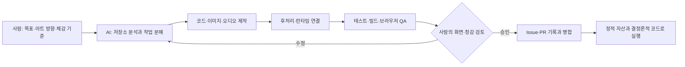

# AI 활용 기술 설명 초안 — dongu-mac 근거

이 문서는 NHN2026 「AI 활용 기술 문서」의 구조 설명에 재사용할 수 있도록 이 macOS 장비의 세션과 저장소 구현을 교차 정리한 기술 메모다. 대화 근거의 컷오프는 2026-08-10 20:44:45 KST이며, 코드 상태는 수집 시점의 `origin/main` 커밋 `e20f297`을 확인했다.

## 1. AI가 사용된 위치

Clicker Guild의 AI 활용은 **개발 단계**에 있다. 현재 게임 의존성에는 AI 모델 SDK가 없고, 플레이 중 외부 모델을 호출해 전투나 NPC를 제어하지 않는다. AI가 만든 코드는 TypeScript/React와 정적 에셋으로 확정되고, 브라우저에서는 입력·상태·타이머에 따라 일반 웹게임처럼 실행된다.

사람은 게임의 핵앤슬래시 방향, 목표 플레이 시간, 스토리 깊이, 이미지의 게임 삽입 적합성, 오디오의 실재감, 최종 병합 여부를 정했다. AI는 기존 코드와 진행 중 작업 조사, 프롬프트 작성, 에셋 생성·후처리, 구현, 자동 검증, 미리보기와 GitHub 기록을 담당했다.

## 2. 애플리케이션 구조

게임은 Next.js 16, React 19, TypeScript 기반의 웹 애플리케이션이며 Vinext/Vite로 빌드한다.

- `app/Game.tsx`: 길드·전투·저장·튜토리얼·오디오·피날레 상태를 조합한다.
- `app/game-data.ts`: 길드원, 지역, 스테이지, 성장 수치의 주요 데이터를 제공한다.
- `app/guild-hub/**`: 여관, 대장간, 연구, 사냥터와 자원 UI를 나눈다.
- `app/opening/**`: 세계 소멸 오프닝의 장면과 표시 상태를 관리한다.
- `app/onboarding/**`: 첫 전투·영입·제작 순서와 화면 입력 제한을 관리한다.
- `app/battle-loot.ts`: 몬스터별 전리품과 토벌 완료 회수 상태를 계산한다.
- `app/battle-audio.ts`, `app/weapon-audio.ts`, `app/progression-audio.ts`: 합성음, 실녹음, 전역 음량·음소거를 연결한다.
- `app/member-animations.ts`: 길드원별 대기·공격·스킬 WebP를 선택한다.
- `public/assets/**`: 필드, 몬스터, 길드 시설, 무기, 전리품, VFX, 오디오를 정적 파일로 제공한다.

AI는 통합 위험이 큰 `Game.tsx`를 여러 작업이 동시에 덮어쓰지 않도록 Issue의 소유 경로와 PR 순서를 확인했다. 이미지와 오디오는 먼저 독립 자산 경로에 넣고, 공용 런타임 연결은 선행 PR이 병합된 뒤 별도 작업으로 진행한 사례가 있다.

## 3. 이미지 생성 파이프라인

### 3.1 입력 구성

세션에서 반복된 이미지 입력은 다음 요소를 결합했다.

1. 용도: 전투용 몬스터, 지역 배경, 길드 시설, 스킬 VFX 등 런타임 역할
2. 기존 시각 기준: 캐릭터 비율, 필드 색감, 게임 UI의 따뜻한 판타지 톤
3. 작은 화면 판독성: 단순한 실루엣, 충분한 여백, 문구·UI·워터마크 금지
4. 후처리 조건: 단색 크로마키 또는 분리 가능한 배경, 투명 알파, 정사각 캔버스
5. 캐릭터별 데이터: 직업, 등급, 무기, 고유 스킬, 대표 색상

1지역 몬스터 공통 입력은 저장소의 `docs/experimental-asset/stage-01-beginners-forest/image-generation-guide.md`에 보존돼 있다. 길드원 입력 기준은 `docs/experimental-asset/guild-member-assets/planning-source.md`에 직업·무기·스킬과 함께 정리돼 있다.

### 3.2 생성과 후처리

이미지 생성 뒤 AI는 다음 처리를 수행했다.

- 크로마키 색을 알파로 변환하고 네 모서리·반투명 가장자리의 잔색을 정리
- PNG 원본을 런타임용 WebP로 변환하고 256·512·640px 등 용도별 크기로 정규화
- 애니메이션은 대기·이동·공격·스킬 프레임과 연결 미리보기로 구성
- 다중 에셋은 manifest에서 캐릭터·지역·스킬 ID와 파일 경로를 연결
- 필드 배경은 전투 중앙을 비우고 가장자리에 장식을 배치해 몬스터와 클릭 효과를 가리지 않게 구성
- 모바일과 데스크톱에서 이미지 로드, 비율, 넘침, 콘솔 오류를 확인

### 3.3 인간 피드백에 따른 재생성

생성 결과는 자동 채택되지 않았다.

- 길드 성장 초안이 홍보물처럼 보인다는 평가 뒤 실제 게임용 투명 스프라이트로 재제작했다.
- 필드 첫 시안이 평면적이라는 평가 뒤 손그림 모바일 RPG 스타일로 10종을 다시 만들었다.
- 길드원 VFX가 큰 정지 사진처럼 보인다는 평가 뒤 크기를 줄이고 CSS 진입 궤적·타격 링·잔광을 합성했다.
- 전리품 아이콘의 사각 프레임이 거슬린다는 평가 뒤 컷아웃 아틀라스를 새로 만들었다.

## 4. 대표 기술 사례

### 4.1 다중 몬스터와 15단계 클릭 무기

초기 단일 몬스터 중심 전투를 화면당 다수의 몬스터가 등장하는 핵앤슬래시 구조로 바꿨다. 각 몬스터는 개별 체력·위치·피격 상태를 가지며, 사용자의 클릭 위치와 공격 반경 안에 있는 대상을 동시에 타격한다. 정확한 체력과 잔여 수는 숨기고 정찰 연구에 따라 전황만 단계적으로 표시한다.

무기 강화는 15단계로 분리해 공격력과 시각·청각 밀도만 올린다. 실제 공격 범위는 별도 발전 노드만 제어하므로 큰 이펙트가 판정을 넓히지 않는다. 클릭 좌표와 이펙트가 어긋나 왼쪽 위에 표시되던 문제, 동일 몬스터의 피격 애니메이션이 한 번만 재생되던 문제를 브라우저에서 재현하고 상태 키와 CSS 위치를 수정했다.

### 4.2 길드원 애니메이션과 전용 VFX

길드원 25명에는 대기·이동·공격·고유 스킬 프레임이 제작됐다. 현재 전투 구조에서는 길드원 본체가 필드에 계속 나타나는 대신, 기본 공격과 쿨다운 스킬이 패시브로 발동한다. `app/member-animations.ts`와 VFX manifest가 멤버 ID를 정적 WebP에 연결한다.

스킬 VFX 25종은 먼저 자산만 독립 PR로 병합한 뒤 공용 전투 파일의 충돌이 해소된 시점에 런타임을 연결했다. 기본 공격은 약 86px·0.52초, 스킬은 약 158px·0.84초의 작은 합성 연출로 조정해 전투 화면을 가리지 않게 했다. 정지 이미지만 노출하지 않고 CSS 진입, 타격 링, 잔광 소멸을 겹쳐 동작감을 만들었다.

### 4.3 전리품 회수와 20분 경제

몬스터 처치 시 전리품이 처치 위치에 남고, 토벌 완료 뒤 HUD로 순차 이동한다. 실제 저장값은 도착 시점에 반영되며, 후퇴·재시작 시 남은 시각 객체가 정리된다. 골드·지역 소재는 크기와 색, 낙하음이 다르고 고단계에서는 동전 대신 주머니·돈뭉치 표현을 사용한다.

처음에는 Web Audio 합성으로 금속성 드롭음을 만들었지만 사람의 청감 평가에서 동전 같지 않다는 피드백을 받았다. 이후 Vinrax와 Kenney의 CC0 실녹음을 짧게 편집하고 피치 변주·교차 재생을 추가했다. 경제는 30종 재료를 지역별 10종으로 통합하고 기존 저장값을 합산 이관했다. 첫 스테이지 보상만으로 첫 무기를 제작할 수 있게 해 10~20분 목표 진행을 맞췄다.

### 4.4 세계 소멸 오프닝과 입력 제한 튜토리얼

오프닝은 처음에 AI 보스와 생성 에셋의 설정을 자세히 설명하는 방향도 탐색했으나, 사용자가 과도한 설정을 제거하도록 교정했다. 최종 구조는 여러 길드가 존재했던 세계, 설명할 수 없는 소멸, 마지막 길드, 몬스터 토벌과 성장만 보여 준다. AI 정체와 최종전 방식은 본편 뒤에 남긴다.

튜토리얼은 오프닝 뒤 사냥터, 1-1 스테이지, 클릭 전투, 무료 10연 영입, 대장간 첫 제작 순으로 진행한다. 각 단계는 목표 영역만 클릭 가능하게 하고 나머지는 dimmed overlay와 포인터 차단으로 막는다. 새 게임·기존 저장·화면 전환에 따라 단계가 중복 실행되지 않도록 저장 상태와 연결했다.

### 4.5 합성음·실녹음·전역 믹스

토벌 시작, 실패, 메뉴, 고용, 무기 제작, 길드 승급과 승리 팡파르는 Web Audio 오실레이터·노이즈·필터·gain envelope로 직접 만들었다. 무기 타격과 동전은 CC0 실녹음을 런타임에서 gain, pitch, filter, stereo, reverb, compressor와 합성 레이어로 가공한다.

사용자는 BGM이 크고 SFX가 작다고 평가했다. AI는 BGM 출력은 낮추고 모든 효과음을 공통 배율로 올리되 기존 사용자 슬라이더와 0% 음소거 의미를 보존했다. 제작·승급·보상·영입의 개별 보정도 같은 전역 설정을 우회하지 않도록 테스트했다.

## 5. AI 보조 개발·검증 절차

1. 사용자가 기능 목표와 체감 품질을 제시한다.
2. AI가 최신 저장소, 진행 중 Issue·PR, 수정 경로와 저장 호환을 조사한다.
3. 독립 작업공간과 브랜치에서 코드 또는 에셋을 만든다.
4. 이미지·오디오는 형식 변환과 manifest·라이선스 기록을 추가한다.
5. 기능 위험에 따라 단위·렌더링·전투·오디오 테스트, lint, production build를 실행한다.
6. 전용 서버에서 데스크톱·모바일 화면, 클릭·저장·오디오를 실제로 확인한다.
7. 사용자가 화면과 소리를 평가하고 수정 방향을 준다.
8. 승인된 결과만 PR로 병합하고 Issue에 검증과 인계를 남긴다.

이 과정은 대화 기억에만 의존하지 않는다. `AGENTS.md`와 `docs/coordination/README.md`가 작업공간 격리, Issue 소유권, PR·검증, 병합 승인 규칙을 저장소 공용 기억으로 유지한다.

## 6. 제출 문서에서 구분할 사항

- AI 모델은 개발에 사용됐고 게임 런타임에는 포함되지 않는다.
- ImageGen 결과는 사람의 선택·후처리·테스트를 거친 정적 에셋이다.
- Web Audio로 직접 합성한 소리는 외부 녹음 파일이 아니며, CC0 실녹음과 구분해 표기해야 한다.
- 별도 실험 브랜치에서 검토된 길드 서바이버형 구조는 최종 제품 방향을 찾기 위한 중간 실험이었고, 모든 초안이 그대로 채택된 것은 아니다.
- PR #138은 수집 시점에 main에 병합됐으므로 Windows 취합본의 이전 `draft` 설명은 중앙 병합 단계에서 최신 상태로 갱신해야 한다.

## 7. 제출 전에 보강해야 할 기술 증빙

- ImageGen 파일별 모델 버전, 생성일시, 원문 프롬프트, 참조 입력, 작업 ID, 후처리, 사람 검수 결과를 연결한 생성 대장
- 10개 필드, 몬스터 28종, 길드 시설·성장, 전리품, 무기·강화 아이콘의 실제 제출 빌드 포함 목록
- 대표 데스크톱·모바일·오디오 QA 캡처와 테스트 실행 결과
- production 의존성 SBOM과 OSS 고지
- 생성 당시 적용된 AI 서비스 약관과 공모전의 AI 생성물 표시 요구사항
