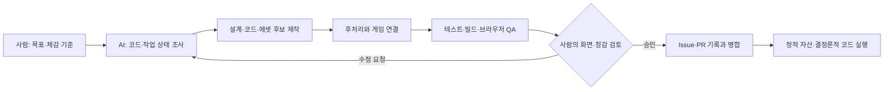

# AI 활용 기술 설명 초안 — note-pen 근거

이 문서는 NHN2026 AI 활용 기술문서의 구조 설명에 재사용할 수 있도록 `note-pen` 세션에서 확인된 개발 과정을 정리한 것이다. 대화 근거의 컷오프는 2026-08-10 20:45:28 KST이며, 중앙 취합 기준은 `codex/nhn2026-ai-session-evidence` 커밋 `4320b05`이다.

## 1. AI가 개입한 위치

Clicker Guild는 Next.js·React·TypeScript 기반의 브라우저 게임이다. 플레이 중 외부 AI 모델을 호출하지 않으며, AI는 개발 과정에서 다음 역할을 수행했다.

- 요구사항과 기존 코드의 영향 범위 분석
- 게임 규칙, 성장 곡선, 화면 흐름 설계
- 이미지 생성 입력 작성과 결과 후처리·런타임 연결
- Web Audio 합성과 공개 음원 조사·통합
- React·TypeScript 구현과 저장 데이터 호환 검토
- 자동 테스트, lint, production build와 브라우저 QA
- GitHub Issue·PR을 이용한 여러 세션·PC 조율

## 2. 애플리케이션 구조

- `app/Game.tsx`: 길드 운영, 전투, 저장, 오디오 등 상위 상태를 조합한다.
- `app/game-data.ts`: 길드원, 지역, 스테이지와 성장 수치를 데이터로 제공한다.
- `app/guild-hub/**`: 길드 시설과 성장 UI를 기능별로 나눈다.
- `app/battle-audio.ts`, `app/weapon-audio.ts`, `app/progression-audio.ts`: 합성음·녹음 파일·전역 음량을 연결한다.
- `public/assets/**`: 이미지, VFX, 오디오를 정적 파일로 제공한다.
- `tests/**`: 렌더링, 진행, 전투, 오디오와 저장 회귀를 확인한다.

AI는 공용 진입점이나 설정 파일을 여러 작업이 동시에 수정하지 않도록 Issue에 수정 경로를 기록하고 작업공간을 분리했다. 자산 제작과 런타임 연결을 별도 작업으로 나눈 뒤 선행 PR이 병합된 상태에서 통합하는 방식도 사용했다.

## 3. 기획·수치 설계

초기 프롬프트는 짧은 개발 기간에 적합한 웹게임 장르와 기술을 비교하게 했다. AI는 길드 운영과 클릭 전투를 연결한 핵심 루프, 첫 플레이 구간, 성장 비용과 보상 곡선을 제안했다. 사람은 복잡한 구조를 줄이고 직접 공격과 길드원 자동화가 즉시 체감되는 방향을 선택했다.

수치는 자연어 설명만으로 확정하지 않고 데이터와 시뮬레이션 대상으로 옮겼다. 개발 모드에서는 자원을 조정해 강화 단계를 빠르게 재현하도록 하고, 정상 플레이 데이터와 분리해 배포 환경에 노출되지 않도록 검토했다.

## 4. 이미지 생성·후처리 파이프라인

1. 런타임 용도와 화면 크기를 먼저 정의했다.
2. 기존 캐릭터·필드의 따뜻한 판타지 톤과 작은 화면 가독성을 입력 조건으로 사용했다.
3. 문구, UI, 로고, 워터마크와 특정 작품의 직접 모방을 제외하도록 지시했다.
4. 결과에서 배경 제거, 가장자리 정리, 크기·형식 정규화를 수행했다.
5. manifest 또는 코드의 ID와 정적 파일 경로를 연결했다.
6. 데스크톱·모바일에서 비율, 넘침, 클릭 영역과 전투 가림을 확인했다.

사람은 단조로운 원형 아이콘, 게임과 어울리지 않는 시설, 텍스트에 의존한 강화 효과를 거부했다. AI는 지도형 스테이지 선택, 게임용 투명 시설 이미지, 충격파·치명타·처형·연격을 구분하는 모션으로 다시 설계했다.

## 5. 오디오 파이프라인

오디오는 세 가지 방식으로 제작·통합했다.

- Web Audio 오실레이터·노이즈·필터·gain envelope를 이용한 프로젝트 자체 합성
- Kenney·OpenGameArt 등 출처가 확인된 CC0 녹음 사용
- 생성형 음악 서비스에서 만든 전투 BGM 후보의 장면별 순환

전역 BGM·SFX 설정, 0% 완전 음소거, 장면 전환, 중복 재생과 상대 음량을 테스트했다. 금화 회수음이 사라진 문제처럼 자동 테스트만으로 판단하기 어려운 항목은 사람이 직접 플레이하고 청감으로 확인했다.

## 6. 대표 구현 사례

### 직접 토벌 중심 흐름

길드 관리와 출정 탭을 반복 이동하던 구조를 줄이고, 스테이지 선택에서 전투로 직접 진입하도록 했다. 전투 중에는 영지 이동과 강화를 제한하고, 제한 시간·후퇴 손실·최초 클리어 뒤 반복 전투 같은 규칙을 상태 전환과 저장 데이터에 연결했다.

### 지도형 스테이지 선택

단순 목록을 지역 배경과 경로를 이용한 지도형 화면으로 바꿨다. AI는 기존 이미지와 레이아웃을 조사하고 데스크톱·모바일 배치를 구현했으며, 사람은 과도한 장식보다 선택 가능 상태와 진행 경로가 명확하게 보이는지를 기준으로 검토했다.

### 강화 발동 피드백

숫자만 변하던 공격 강화를 충격파, 치명타, 처형, 연격 등 서로 다른 시각 반응으로 표현했다. 기본 공격에는 불필요한 텍스트를 제거하고, 광클 상황에서도 효과가 서로 끊기거나 전투 대상을 가리지 않도록 인스턴스와 수명을 조정했다.

## 7. 검증과 협업

각 작업은 저장소 상태 조사, Issue 선점, 독립 브랜치·worktree, 구현, 자동 검증, 전용 미리보기, 사람의 승인, PR 병합 순서로 진행됐다. 인증 오류는 실제 401과 샌드박스 네트워크 차단을 구분하고, 가능한 GitHub 작업은 연결된 앱을 우선 사용했다.

## 8. 제출 문서에서 구분할 사항

- AI는 개발 단계에 사용됐으며 게임 런타임의 의사결정자가 아니다.
- 생성된 이미지·음악은 사람이 선택·수정·검증한 정적 자산이다.
- 실험 브랜치와 최종 병합 기능을 구분해야 한다.
- 비식별 재구성 프롬프트를 실제 원문 인용처럼 표시하면 안 된다.
- 최종 제출 빌드 기준 에셋 대장, 생성 기록, 약관 사본과 production SBOM을 추가 확인해야 한다.

